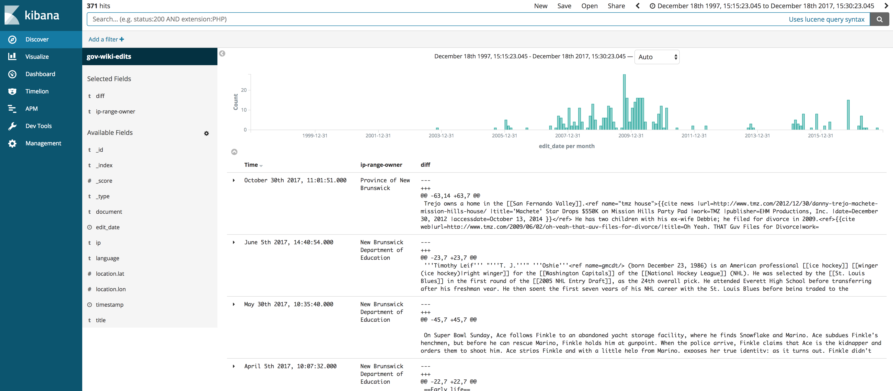

# jacobsanford/wikiHistoryParser
Easily process and browse a Wikimedia's anonymous page edit history for specific IP ranges.



## Requirements
* [docker](https://www.docker.com)
* [docker-compose](https://docs.docker.com/compose/)

## Overview and Notes
Parsing the entire history of a language's wiki pages takes significant computational resources and will temporarily consume large amounts of storage and bandwidth. Although the ```processQueue.sh``` script [cleans up orphaned images and volumes with extreme prejudice](https://github.com/JacobSanford/wikiHistoryParser/blob/master/processQueue.sh#L12), expect to require (conservatively) ```MAX_THREADS * 100GB``` of disk space while processing the files. The final storage requirements are minimal.

## Quick Start
### Populate the wiki edit history page file queue
Fetch a list of archive .gz files to parse, storing them in the ElasticSearch index.
```
docker-compose up
```

### Define IP ranges to parse
Change the ```processfile/src/FilterIpRanges.py``` file to set the CIDR ranges you wish to parse.

### Process a single page history archive file
Grab a single file from the index and process it.
```
docker-compose run processfile
```

### Process many/all page history archive files
It is likely that you would like to parse the entire history rather than a single file. To do so, edit the ```processQueue.sh``` script to alter variables to suit your needs, and run it:

```
./processQueue.sh
```

### View the edits
The ```docker-compose.yml``` file deploys a vanilla Kibana instance that can be used to browse and filter the ElasticSearch data. You can access that via http://localhost:5601.

### Update the wiki page edit history page file queue
At a later time, you may wish to queue the new files that have been added with recent edits.

```
docker-compose run gethistoryfiles
```

## Sources
* The ELK stack components of this work were based on the wonderful [Docker ELK stack by Antoine Cotten](https://github.com/antoineco).
* IP Ranges for the Government of Canada based on [Nick Ruest's list](https://github.com/ruebot/gccaedits-ip-address-ranges)

## License
- wikiHistoryParser is licensed under the MIT License:
  - http://opensource.org/licenses/mit-license.html
- Attribution is not required, but much appreciated:
  - `wikiHistoryParser by Jacob Sanford`
